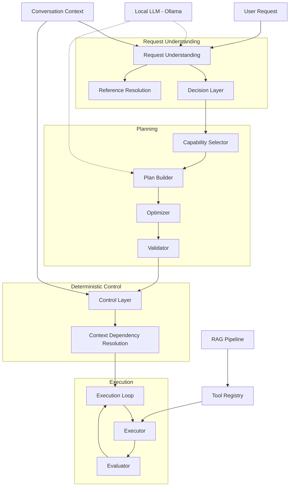
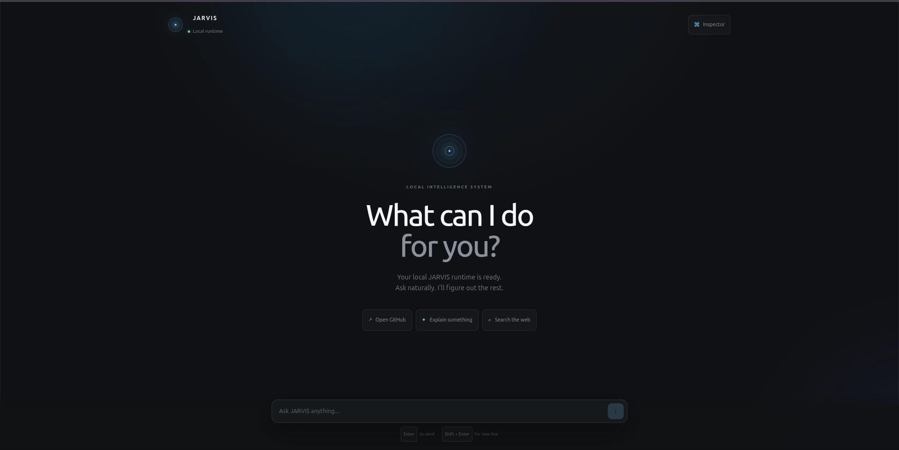
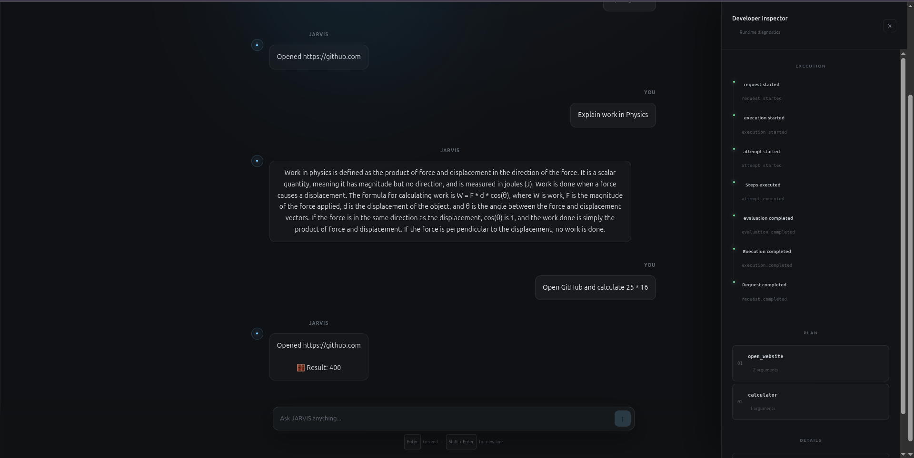
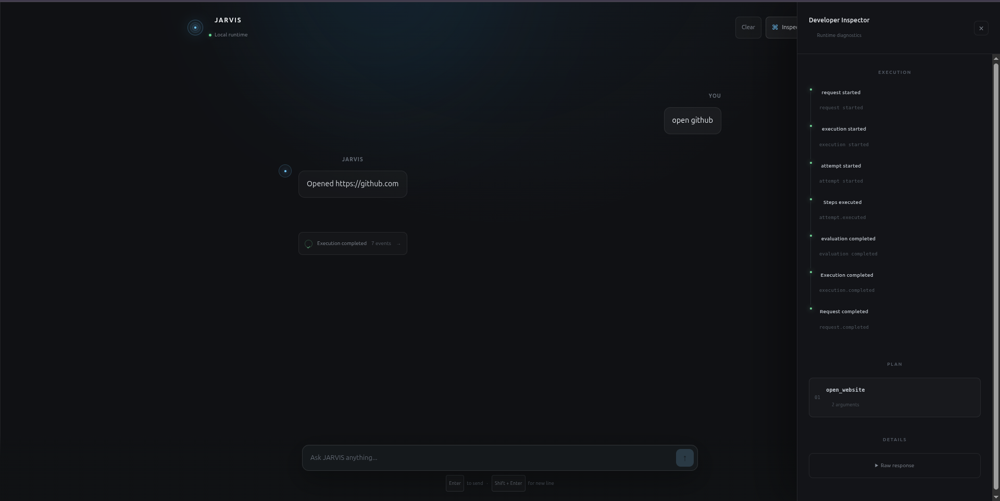

# JARVIS

### A local AI agent runtime built around request understanding, planning, deterministic execution control, conversational context, and inspectable execution.

JARVIS is an experimental local AI runtime designed to turn natural-language requests into structured, executable workflows.

The system separates **understanding**, **planning**, **control**, and **execution** so that language-model reasoning does not directly control the execution layer.

> **Current status: M7 — Planner Migration (in progress)**

---

## What is JARVIS?

JARVIS explores how a practical AI agent can be designed as a **structured runtime rather than a single LLM prompt**.

A request moves through a sequence of stages:

```text
User Request
     ↓
Request Understanding
     ↓
Decision
     ↓
Capability Selection
     ↓
Planning
     ↓
Deterministic Control
     ↓
Execution
     ↓
Evaluation
     ↓
Repair / Completion
```

The goal is to make agent behavior **inspectable, testable, and controllable** while still using an LLM for natural-language understanding and reasoning.

---

## Why JARVIS?

Many simple AI agents follow a pattern similar to:

```text
User → LLM → Tool
```

JARVIS experiments with a more structured runtime:

```text
User
 ↓
Understand the request
 ↓
Determine what should happen
 ↓
Build a plan
 ↓
Apply deterministic control
 ↓
Execute tools
 ↓
Evaluate the result
 ↓
Repair or complete
```

This creates explicit boundaries between probabilistic reasoning and deterministic system behavior.

---

## Architecture



The architecture is being migrated incrementally during **M7**, so some boundaries are currently transitional rather than final.

---

## How a Request Works

Consider:

```text
Open GitHub and calculate 25 * 16
```

JARVIS can decompose the request into multiple actions:

```text
1. open_website
2. calculator
```

The runtime then executes those actions while exposing the execution lifecycle to the developer interface.

The current system can surface events such as:

```text
request started
execution started
attempt started
steps executed
evaluation completed
execution completed
request completed
```

For failed execution paths, the runtime can also enter a repair attempt.

For example, an invalid intermediate step may be removed while successful work is preserved.

---

## Current Capabilities

### Request understanding

JARVIS contains explicit request-understanding structures for:

- request segmentation
- entity extraction
- decision handling
- conversational references
- clarification handling

### Planning

The planner currently works with explicit architectural boundaries for:

- capability selection
- plan construction
- task construction
- optimization
- validation
- retrieval policy

### Deterministic execution control

The control layer sits between planning and execution and performs deterministic checks such as:

- argument/context validation
- query sanitization
- deduplication
- canonical ordering
- fallback handling
- safe arithmetic evaluation

### Tool execution

The current runtime includes tools for capabilities such as:

- web navigation
- calculation
- explanation
- document loading
- RAG search
- web retrieval
- echo/testing

### Conversation context

Requests can be associated with conversation state so that the runtime can reason about references and previous context.

### RAG

JARVIS contains a retrieval pipeline built around:

```text
Documents
   ↓
Ingestion
   ↓
Embeddings
   ↓
Vector Store
   ↓
Retriever
   ↓
RAG QA
```

### Developer Inspector

The GUI exposes runtime information including:

- execution events
- execution attempts
- plan steps
- argument counts
- raw responses
- completion state

---

# JARVIS in Action

## Landing Interface



The current GUI provides a conversational interface for interacting with the local runtime.

---

## Full Runtime Session



This view shows the system operating across multiple interactions, including:

- conversational history
- natural-language requests
- tool execution
- multi-step plans
- execution results
- runtime inspection

---

## Developer Inspector



The Developer Inspector exposes the internal execution lifecycle, making the runtime behavior easier to observe while developing the system.

---

# Running JARVIS Locally

## Requirements

- Python 3.12+
- `uv`
- Ollama
- Node.js / npm

JARVIS currently uses a local Ollama model for LLM operations.

The development environment has been tested with:

```text
phi3
```

---

## Backend

From the repository root:

```bash
uv sync
```

Make sure Ollama is running and the required model is available:

```bash
ollama pull phi3
```

Start the API server:

```bash
uv run uvicorn api.server:app --reload
```

The backend will be available at:

```text
http://127.0.0.1:8000
```

Health endpoint:

```text
http://127.0.0.1:8000/api/health
```

---

## Frontend

Open another terminal:

```bash
cd gui
npm install
npm run dev
```

The Vite development server will normally run at:

```text
http://localhost:5173
```

---

# Testing

The project contains unit and integration tests covering areas such as:

- planning
- request understanding
- tool selection
- validation
- optimization
- execution
- reference resolution
- conversation state
- retrieval policy
- execution repair
- runtime request handling

Run the Python test suite with:

```bash
uv run pytest
```

---

# Project Structure

```text
jarvis-ai/
│
├── api/
│   └── server.py
│
├── app/
│   ├── runtime.py
│   ├── models.py
│   └── events.py
│
├── brain/
│   └── llm.py
│
├── planner/
│   ├── planner.py
│   ├── plan_builder.py
│   ├── capability_selector.py
│   ├── request_understanding.py
│   ├── request_understanding_adapter.py
│   ├── task_builder.py
│   ├── optimizer.py
│   └── validator.py
│
├── control/
│   ├── control_layer.py
│   ├── decision_layer.py
│   ├── execution_loop.py
│   └── evaluator.py
│
├── execution/
│   └── context_dependency.py
│
├── executor/
│   └── executor.py
│
├── conversation/
│   ├── manager.py
│   ├── context.py
│   ├── reference_detector.py
│   └── reference_resolver.py
│
├── rag/
│   ├── embedder.py
│   ├── ingestor.py
│   ├── retriever.py
│   └── qa.py
│
├── retriever/
│
├── tools/
│   ├── registry.py
│   ├── basic_tools.py
│   ├── calculator_tool.py
│   ├── explain_tool.py
│   ├── load_doc_tool.py
│   ├── rag_tool.py
│   └── web_retriever_tool.py
│
├── gui/
│   └── React + TypeScript frontend
│
├── tests/
│
└── docs/
    ├── assets/
    ├── diagrams/
    ├── PLAN.md
    └── architecture documentation
```

---

# Design Principles

### 1. Understand before executing

Natural-language input should not directly become tool execution.

### 2. Capabilities are different from tools

A capability represents **what the system needs to accomplish**.

A tool represents **how the system performs it**.

This separation allows the planner to reason at a higher level than individual tool implementations.

### 3. Keep deterministic control deterministic

Validation, sanitization, deduplication, ordering, and execution safeguards should not depend unnecessarily on another LLM decision.

### 4. Preserve observability

Important runtime decisions and execution events should be inspectable during development.

### 5. Migrate incrementally

JARVIS is being evolved through explicit architectural milestones rather than rewriting the entire runtime at once.

---

# Current Status

## Completed

The current development branch has completed:

```text
M0
M1
M2
M3
M4
M5
M6
```

## In Progress

```text
M7 — Planner Migration
```

M7 is restructuring the runtime around a clearer separation between:

```text
Request Understanding
        ↓
Decision
        ↓
Planning
```

The migration is intentionally incremental so existing behavior and tests can be preserved while new architectural boundaries are introduced.

## Planned

Later milestones include further work on:

- planner migration completion
- execution/event contracts
- API evolution
- GUI restructuring
- stronger end-to-end testing
- documentation cleanup
- final architectural consolidation

These are **planned rather than currently implemented**.

---

# Current Limitations

JARVIS is an active engineering project rather than a finished autonomous assistant.

Current limitations include:

- planner migration is still in progress
- some architectural boundaries are transitional
- execution repair currently uses a constrained repair strategy
- GUI architecture is still being evolved
- some interfaces and documentation will change as migration milestones are completed

The project intentionally documents these limitations rather than presenting future architecture as already implemented.

---

# Roadmap

The detailed engineering roadmap is maintained in:

[`docs/PLAN.md`](docs/PLAN.md)

The roadmap is organized into milestones so architectural changes can be introduced and verified incrementally.

---

# Development Philosophy

JARVIS is an exploration of a simple question:

> **What does it take to build an AI agent as a real software system rather than just an LLM wrapped around a few tools?**

The project focuses on the engineering boundaries that become important as an agent grows:

```text
Understanding
Planning
Context
Tools
Control
Execution
Evaluation
Observability
```

---

## Status

**Active development — M7 Planner Migration**

Built with:

**Python · FastAPI · Ollama · Pydantic · RAG · React · TypeScript · Vite**

---